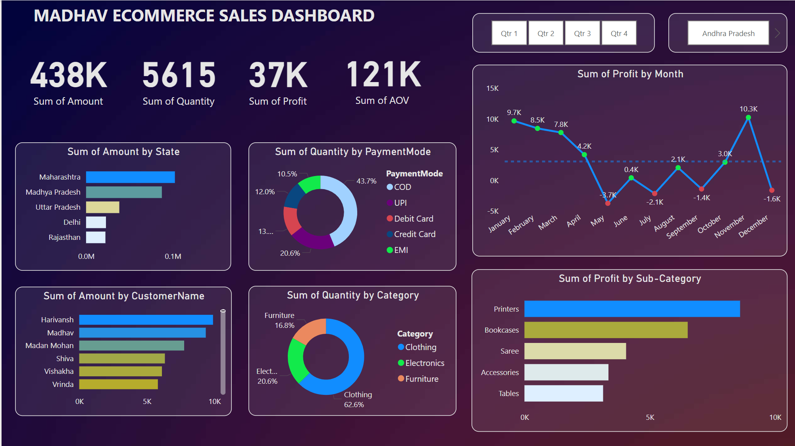

# E-commerce Sales Dashboard

## Problem Statement
This dashboard is designed to help e-commerce businesses track sales performance, customer behavior, and profitability. It visualizes key metrics to assist in data-driven decision-making, such as:

- Regional sales performance
- Top customers and payment preferences
- Product category and subcategory analysis
- Monthly profit trends

## Dashboard Overview

- **KPIs**: Total Sales, Quantity, Profit, AOV
- **Sales by State**: Bar chart showing the sales amount by region
- **Quantity by Payment Mode**: Doughnut chart depicting the preferred payment methods
- **Profit by Month**: Line/Area chart visualizing monthly profit trends
- **Top Customers**: Bar chart displaying top customers by sales
- **Product Category Analysis**: Doughnut chart of sales by category
- **Profit by Sub-Category**: Bar chart showing profit contributions of subcategories

## Tools
- **Power BI**: Used for data visualization
- **Data Source**: E-commerce sales data

## Conclusion
This dashboard provides a quick overview of key business metrics, enabling better decision-making and strategic planning.

